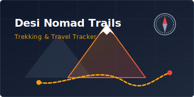
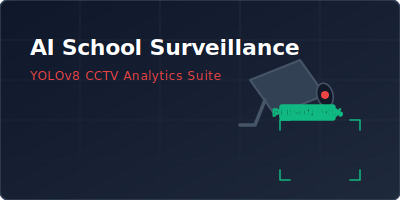
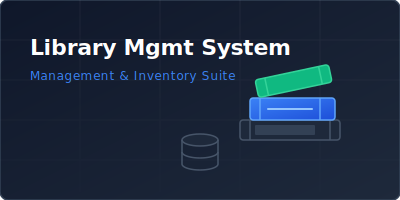
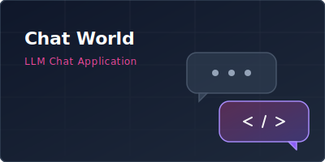

<!--
  READ ME FIRST: Welcome to your new elite GitHub Profile!
  To customize this profile, replace all placeholders like [Suraj881raftaar] or [YOUR_EMAIL] with your actual details.
-->

<div align="center">
  
</div>

<br />

<div align="center">
  
  # Hi there, I'm Suraj Yadav 👋
  
  <a href="https://git.io/typing-svg">
    
  </a>

  **Building the future of Autonomous Agents, Semantic Search systems, and responsive Full-Stack applications.**

  [](https://github.com/Suraj881raftaar)
  [](https://linkedin.com/in/Suraj881raftaar)
  [](https://x.com/Suraj881raftaar)
  [](mailto:your.email@example.com)

  <br />

  [🌐 Personal Portfolio](https://YOUR-PORTFOLIO-URL.dev) • [📄 View Resume](https://YOUR-RESUME-LINK.pdf) • [✉️ Get In Touch](mailto:your.email@example.com)
  
</div>

---

## ⚡ About Me

<table border="0">
  <tr>
    <td width="50%" valign="top">
      <h3>🤖 AI Engineer</h3>
      <p>Architecting production-ready LLM pipelines. Designing multi-agent systems, LangGraph workflows, and advanced retrieval-augmented generation (RAG) engines to solve complex enterprise search and decision problems.</p>
      
      <h3>💻 Full-Stack Developer</h3>
      <p>Crafting responsive, high-performance web applications with React, Next.js, and FastAPI. Strong focus on clean code, clean UI architectures, and glassmorphic designs.</p>

      <h3>🐍 Python Specialist</h3>
      <p>Writing elegant, clean, and highly performant backend architectures. Passionate about object-oriented design, microservices, and asynchronous event loops.</p>
    </td>
    <td width="50%" valign="top">
      <h3>☁️ Cloud &amp; DevOps</h3>
      <p>Deploying serverless apps, auto-scaling clusters, and automated CI/CD pipelines using Docker, GitHub Actions, AWS, and Azure. Strong command over Linux server setups.</p>

      <h3>🏔️ Adventure Explorer</h3>
      <p>When my screens are off, I climb high-altitude mountain trails, camp in the wilderness, and explore unseen landscapes. Trekking keeps my focus sharp and mind clear.</p>

      <h3>🧠 Continuous Learner</h3>
      <p>Constantly staying updated with the latest AI breakthroughs, reading academic papers, contributing to open-source software, and building tools that matter.</p>
    </td>
  </tr>
</table>

---

## 🛠️ Technical Skillset

### 🧠 Artificial Intelligence & LLMs
<p align="left">
  
  
  
  
  
  
</p>

### 💻 Languages & Frameworks
<p align="left">
  <a href="https://skillicons.dev">
    
  </a>
</p>

### ⚙️ DevOps, Infrastructure & Tooling
<p align="left">
  <a href="https://skillicons.dev">
    
  </a>
</p>

---

## 📈 GitHub Metrics

<div align="center">
  <table border="0">
    <tr>
      <td width="50%" align="center">
        
      </td>
      <td width="50%" align="center">
        
      </td>
    </tr>
    <tr>
      <td width="50%" align="center">
        
      </td>
      <td width="50%" align="center">
        
      </td>
    </tr>
  </table>
</div>

<br />

### 🐍 Contribution Snake
<div align="center">
  <picture>
    <source media="(prefers-color-scheme: dark)" srcset="https://raw.githubusercontent.com/Suraj881raftaar/Suraj881raftaar/output/github-contribution-grid-snake-dark.svg" />
    <source media="(prefers-color-scheme: light)" srcset="https://raw.githubusercontent.com/Suraj881raftaar/Suraj881raftaar/output/github-contribution-grid-snake.svg" />
    
  </picture>
</div>

---

## 🚀 Featured Projects

<table border="0">
  <tr>
    <!-- Project 1 -->
    <td width="50%" valign="top">
      
      <h3>🗺️ Desi Nomad Trails</h3>
      <p>An AI-powered trekking, hiking, camping, and adventure platform with interactive maps, bookings, GPX tracking, blogs, weather integration, and an AI travel assistant.</p>
      <p>
        
        
        
        
        
        
        
      </p>
      <p>
        <a href="https://github.com/Suraj881raftaar/Desi-nomad-"><b>📂 Repository</b></a> | 
        <span><b>🌐 Demo: Coming Soon</b></span>
        <br />
        
      </p>
    </td>
    <!-- Project 2 -->
    <td width="50%" valign="top">
      
      <h3>🔒 AI School Surveillance System</h3>
      <p>An AI-powered CCTV analytics platform featuring real-time face recognition, attendance tracking, intruder detection, violence detection, weapon detection, student tracking, and automated parent notifications.</p>
      <p>
        
        
        
        
        
      </p>
      <p>
        <a href="https://github.com/Suraj881raftaar/AI-School-Surveillance-System"><b>📂 Repository</b></a> | 
        <span><b>🌐 Demo: Coming Soon</b></span>
        <br />
        
      </p>
    </td>
  </tr>
  <tr>
    <!-- Project 3 -->
    <td width="50%" valign="top">
      
      <h3>📚 Library Management System</h3>
      <p>Desktop administration system featuring user authentication, issue/return transactions, student records management, administrative dashboards, comprehensive reporting, and instant search catalogs.</p>
      <p>
        
        
        
      </p>
      <p>
        <span><b>📂 Repository: Coming Soon</b></span> | 
        <span><b>🌐 Demo: Desktop App Only</b></span>
        <br />
        
      </p>
    </td>
    <!-- Project 4 -->
    <td width="50%" valign="top">
      
      <h3>💬 Chat World</h3>
      <p>A lightweight, real-time local chat application developed as a BCA graduation project, designed to explore multi-threading sockets, structured command logs, and instant message routing.</p>
      <p>
        
        
      </p>
      <p>
        <span><b>📂 Repository: Coming Soon</b></span> | 
        <span><b>🌐 Demo: Coming Soon</b></span>
        <br />
        
      </p>
    </td>
  </tr>
</table>

---

## 🗺️ Roadmap & Timeline

```
 ┌────────────────────────────────────────────────────────┐
 │ 💻 2020: Started Programming (C, Python, HTML/CSS)     │
 └─────────────────────────┬──────────────────────────────┘
                           ▼
 ┌────────────────────────────────────────────────────────┐
 │ 🎓 2023: BCA Graduate (Bachelor of Computer Apps)     │
 └─────────────────────────┬──────────────────────────────┘
                           ▼
 ┌────────────────────────────────────────────────────────┐
 │ 💼 2024: Store Assistant (Ops, Inventory, Org)        │
 └─────────────────────────┬──────────────────────────────┘
                           ▼
 ┌────────────────────────────────────────────────────────┐
 │ 🧠 2025: Learning AI (ML, NLP, Embeddings, RAG)        │
 └─────────────────────────┬──────────────────────────────┘
                           ▼
 ┌────────────────────────────────────────────────────────┐
 │ 🚀 2026: Building AI Products (Agents, LangGraph)      │
 └─────────────────────────┬──────────────────────────────┘
                           ▼
 ┌────────────────────────────────────────────────────────┐
 │ 🤝 2026: Open Source Contributor (Tooling & Frameworks)│
 └─────────────────────────┬──────────────────────────────┘
                           ▼
 ┌────────────────────────────────────────────────────────┐
 │ 🏢 Future Goal: Co-founding / Joining an AI Startup    │
 └────────────────────────────────────────────────────────┘
```

---

## 🎓 Professional Certifications

<div align="center">
  <table border="0">
    <tr>
      <td align="center" width="16%">
        <br />
        <sub>Cloud Practitioner</sub>
      </td>
      <td align="center" width="16%">
        <br />
        <sub>Fundamentals (AZ-900)</sub>
      </td>
      <td align="center" width="16%">
        <br />
        <sub>Cloud Digital Leader</sub>
      </td>
      <td align="center" width="16%">
        <br />
        <sub>Front-End Developer</sub>
      </td>
      <td align="center" width="16%">
        <br />
        <sub>AI Engineering Specialist</sub>
      </td>
      <td align="center" width="16%">
        <br />
        <sub>Network Associate (CCNA)</sub>
      </td>
    </tr>
  </table>
</div>

---

<table border="0" width="100%">
  <tr>
    <!-- Blog Section -->
    <td width="50%" valign="top">
      <h2>✍️ Latest Blog Posts</h2>
      <!-- BLOG-POST-LIST:START -->
      - [Building Autonomous AI Agents with LangGraph (2026)](https://medium.com/@surajyadav)
      - [Optimizing RAG Pipelines: Embeddings, Chunking, and Re-ranking](https://medium.com/@surajyadav)
      - [Mastering FastAPI: Serverless Deployment Best Practices](https://medium.com/@surajyadav)
      <!-- BLOG-POST-LIST:END -->
    </td>
    <!-- Latest GitHub Activity -->
    <td width="50%" valign="top">
      <h2>activity: Activity Feed</h2>
      <!-- START_SECTION:activity -->
      - 📝 Committed to `desi-nomad-trails/main`
      - 🌟 Starred `langchain-ai/langgraph`
      - 🐛 Created issue #12 in `library-management-system`
      <!-- END_SECTION:activity -->
    </td>
  </tr>
</table>

---

## 🎵 Currently Jamming To
<div align="center">
  <a href="https://open.spotify.com/user/YOUR_SPOTIFY_USER_ID">
    
  </a>
</div>

---

## 💭 Coding Inspiration

<!-- DAILY-QUOTE:START -->
> **"Simplicity is the soul of efficiency."**
>
> *— Austin Freeman*
<!-- DAILY-QUOTE:END -->

---

## ☕ Coffee & Fun Facts

<div align="center">
  <table border="0">
    <tr>
      <td align="center" width="25%">
        ☕ <b>Coffee Consumed</b><br />
        
      </td>
      <td align="center" width="25%">
        ⏱️ <b>Hours Coded</b><br />
        
      </td>
      <td align="center" width="25%">
        🏔️ <b>Trekking Peaks</b><br />
        
      </td>
      <td align="center" width="25%">
        🏆 <b>Achievements</b><br />
        
      </td>
    </tr>
  </table>
</div>

<br />

> **Joke of the Day:** Why do programmers prefer dark mode? Because light attracts bugs! 🪲

---

<!-- Animated Footer Wave -->
<div align="center">
  <svg viewBox="0 0 1440 120" width="100%" height="80" fill="none" xmlns="http://www.w3.org/2000/svg">
    <path d="M0 32L60 37.3C120 43 240 53 360 48C480 43 600 21 720 21.3C840 21 960 43 1080 48C1200 53 1320 43 1380 37.3L1440 32V120H1380C1320 120 1200 120 1080 120C960 120 840 120 720 120C600 120 480 120 360 120C240 120 120 120 60 120H0V32Z" fill="#8B5CF6" fill-opacity="0.15">
      <animate attributeName="d" dur="10s" repeatCount="indefinite" values="
        M0 32L60 37.3C120 43 240 53 360 48C480 43 600 21 720 21.3C840 21 960 43 1080 48C1200 53 1320 43 1380 37.3L1440 32V120H1380C1320 120 1200 120 1080 120C960 120 840 120 720 120C600 120 480 120 360 120C240 120 120 120 60 120H0V32Z;
        M0 48L60 42.7C120 37 240 27 360 37.3C480 48 600 75 720 80C840 85 960 69 1080 58.7C1200 48 1320 43 1380 40L1440 37.3V120H1380C1320 120 1200 120 1080 120C960 120 840 120 720 120C600 120 480 120 360 120C240 120 120 120 60 120H0V48Z;
        M0 32L60 37.3C120 43 240 53 360 48C480 43 600 21 720 21.3C840 21 960 43 1080 48C1200 53 1320 43 1380 37.3L1440 32V120H1380C1320 120 1200 120 1080 120C960 120 840 120 720 120C600 120 480 120 360 120C240 120 120 120 60 120H0V32Z
      " />
    </path>
    <path d="M0 64L60 58.7C120 53 240 43 360 48C480 53 600 75 720 74.7C840 75 960 53 1080 48C1200 43 1320 53 1380 58.7L1440 64V120H1380C1320 120 1200 120 1080 120C960 120 840 120 720 120C600 120 480 120 360 120C240 120 120 120 60 120H0V64Z" fill="#06B6D4" fill-opacity="0.1">
      <animate attributeName="d" dur="15s" repeatCount="indefinite" values="
        M0 64L60 58.7C120 53 240 43 360 48C480 53 600 75 720 74.7C840 75 960 53 1080 48C1200 43 1320 53 1380 58.7L1440 64V120H1380C1320 120 1200 120 1080 120C960 120 840 120 720 120C600 120 480 120 360 120C240 120 120 120 60 120H0V64Z;
        M0 21L60 32C120 43 240 64 360 64C480 64 600 43 720 37.3C840 32 960 43 1080 48C1200 53 1320 64 1380 69.3L1440 75.7V120H1380C1320 120 1200 120 1080 120C960 120 840 120 720 120C600 120 480 120 360 120C240 120 120 120 60 120H0V21Z;
        M0 64L60 58.7C120 53 240 43 360 48C480 53 600 75 720 74.7C840 75 960 53 1080 48C1200 43 1320 53 1380 58.7L1440 64V120H1380C1320 120 1200 120 1080 120C960 120 840 120 720 120C600 120 480 120 360 120C240 120 120 120 60 120H0V64Z
      " />
    </path>
  </svg>
  
  <br />
  
  Made with ❤️ using Markdown | © 2026 Suraj Yadav. All rights reserved.
  
  <br />
  
  <!-- Visitor Counter -->
  

</div>
